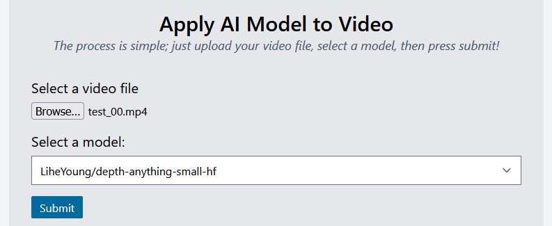

# AI Video FX

An application that leverages the power of AI models to manipulate frames of a video file.

## Roadmap
There's a lot more to do. I am being lazy about using issues, but feel free to add some if you want. As for the immediate future of this project I intend to:

- Generate the static version of the UI using Next.js SSG
- Change the `API_URL` variable based on where the API is actually hosted
    - I might be able to do this if I host the API and UI on the same server, so after I build using SSG, I can expose GET / in `api.py` to return the webpage.

## About
I wanted to learn about using AI models and found a few depth models that produce interesting results when given an image. I wanted to create an application that would make it simple for me to upload a video to be processed through these AI models and the result to be saved.

## Supported Models
| Model Name                                                                                    | Input                    | Result                     |
| --------------------------------------------------------------------------------------------- | ------------------------ | -------------------------- |
| [LiheYoung/depth-anything-small-hf](https://huggingface.co/LiheYoung/depth-anything-small-hf) |  |  |

_Note: More models will be added when I feel like it or get a request._

## Running the application and API



### Run UI
The front-end UI was developed using React and Next.js. The UI will run on `localhost:3000` by default.

Note: `API_URL` is defined as a constant in `app\page.js`. If you want to run the API on a different port or with a different URL, modify the value for `API_URL`. This will eventually change to building the static site using Next.js SSG.

```
npx next dev
// npx next build
```

### Run API
The API was developed using FastAPI and will run on `localhost:8000` by default.

```
fastapi dev api/api.py
```